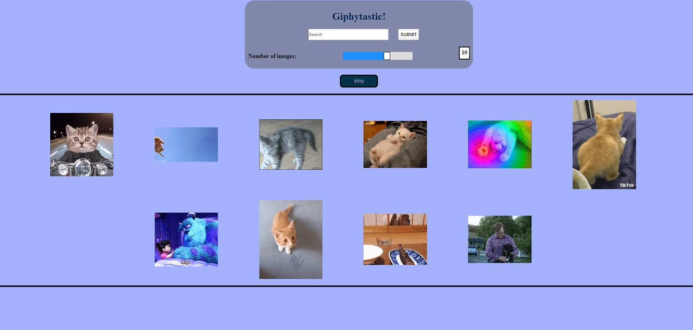

# Giphytastic

#### How to Use:
Powered by the Giphy API, allows users to search for and view images.  In the text box, type in a keyword (eg. cats, babies, dolls ... ) and be amazed with the cool pictures!  Click on the image to see it in motion.  Adjust the slider to see more or less results per searc

[See it Live](https://akaryrye.github.io/Giphytastic/)

#### Installation:

HTTPS:   `$ Git Clone https://github.com/akaryrye/Giphytastic.git`

SSH:   `$ Git Clone git@github.com:akaryrye/Giphytastic.git`

Then, simply open index.html in your browser.

#### Technologies:
HTML, CSS, Vanilla JS

#### Author:
Ryan K Alldrin

Thank you for checking it out and I hope you enjoyed this!
